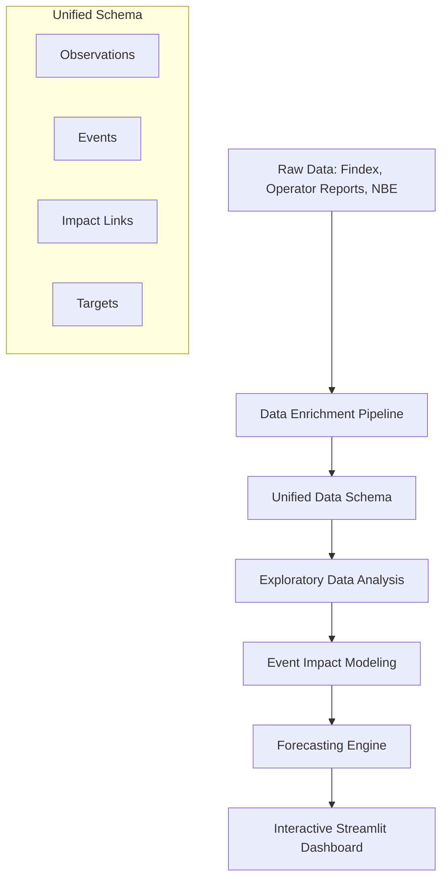

# 🇪🇹 Ethiopia Financial Inclusion Forecasting System

[](https://github.com/game-ale/ethiopia-fi-forecast)
[](https://www.python.org/)
[](LICENSE)

> "A comprehensive forecasting system tracking Ethiopia's digital financial transformation (2011–2027) using time-series analysis and event-impact modeling."

---

## 📊 Overview

Ethiopia is undergoing a rapid digital financial transformation. While mobile money registration has surged (Telebirr >54M, M-Pesa >10M), Global Findex demand-side data shows a complex picture of account ownership growth. This project builds a predictive system for the **Consortium of Stakeholders** to understand the drivers behind these trends and project inclusion outcomes for **2025–2027**.

### 🎯 Key Objectives
1.  **Enrich** legacy datasets with leading infrastructure and enabler metrics (Smartphones, 4G, Digital ID).
2.  **Analyze** the "Ownership Paradox" and the P2P-to-ATM crossover.
3.  **Model** the lagging impacts of policy shifts (FX Liberalization, Open Banking) and product launches.
4.  **Forecast** Access and Usage indicators with high/medium/low scenarios.

---

## 🏗 System Architecture



---

## 📂 Project Structure

```text
ethiopia-fi-forecast/
├── data/
│   ├── raw/                  # Enriched unified data (CSV)
│   └── processed/            # Feature-engineered & Forecast data
├── notebooks/
│   ├── EDA.ipynb             # Interactive deep-dive into inclusion patterns
│   ├── impact_modeling.ipynb # Validation of event impacts
│   └── forecasting.ipynb     # Scenario visualization
├── src/
│   ├── init_data.py          # Excel-to-Unified-CSV conversion
│   ├── enrich_data.py        # Pipeline for adding new proxy observations
│   ├── impact_modeling.py    # Logic for quantifying event-indicator links
│   ├── forecast.py           # Forecasting engine (Trend + Event Model)
│   └── eda.py                # Static analysis report generation
├── reports/
│   ├── figures/              # Professional visualizations & trend plots
│   ├── interim_report.md     # Phase 1 & 2 Synthesis for Consortium
│   └── eda_summary.md        # Detailed findings on the 2021-2024 slowdown
├── dashboard/
│   └── app.py                # Streamlit interface
├── requirements.txt          # Reproducible environment
└── README.md                 # Project Documentation
```

---

## 🚀 Getting Started

### 1. Installation
Ensure you have Python 3.12+ installed.
```bash
git clone https://github.com/game-ale/ethiopia-fi-forecast.git
cd ethiopia-fi-forecast
pip install -r requirements.txt
```

### 2. Data Pipeline
Initialize and enrich the dataset:
```bash
python src/init_data.py
python src/enrich_data.py
```

### 3. Explore & Model
Run the static analysis or launch the notebook:
```bash
python src/eda.py
python src/impact_modeling.py
python src/forecast.py
```

### 4. Interactive Dashboard
Results are served via a Streamlit app.
```bash
streamlit run dashboard/app.py
```

---

## 🧠 Key Insights (Interim)

> [!IMPORTANT]
> **The Ownership Paradox**: Account ownership grew only **3pp (46% → 49%)** between 2021-2024 despite a **10x** increase in mobile money registrations. This suggests significant overlap and a need for deeper usage-based metrics.


> [!TIP]
> **Digital Dominance**: In October 2024, the volume of digital P2P transfers officially surpassed ATM cash withdrawals for the first time in Ethiopia's history (Ratio: 1.08).


---

## 📅 Roadmap

- [x] **Task 1**: Data Exploration & Unified Schema Enrichment
- [x] **Task 2**: Exploratory Data Analysis & Milestone Identification
- [x] **Task 3**: Event Impact Modeling (Quantifying Lags & Magnitudes)
- [x] **Task 4**: Time-Series Forecasting (2025–2027)
- [x] **Task 5**: Stakeholder Dashboard Deployment

---

## 🤝 Collaboration
This project is developed for the **Selam Analytics** consortium. Use branches `task-1`, `task-2`, etc., for specific feature development.

**Analyst:** Gemechu Alemu
**Last Updated:** February 3, 2026
